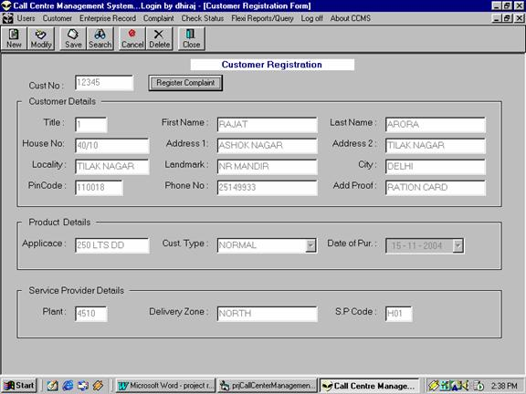



## Call Management System

### Description

It is a Complete Call Management System using VB6.0 and SQL 7.0, I try to use maximum powers of Vb as Classes, Modules, Components etc. Your comments and suggesitions will be appreciated. I use front end validations for very few forms so supply data for all fields, You can also download Ms-Access database for this project from

http://members.fortunecity.com/rajatplanet

Rajat Arora
 
### More Info
 
Front end validations are applied for very few forms so supply details for all fields.

             |
---                |---
**Submitted On**   |2004-11-22 23:07:28
**By**             |[Rajat Arora](https://github.com/Planet-Source-Code/PSCIndex/blob/master/ByAuthor/rajat-arora.md)
**Level**          |Intermediate
**User Rating**    |4.4 (31 globes from 7 users)
**Compatibility**  |VB 6\.0
**Category**       |[Complete Applications](https://github.com/Planet-Source-Code/PSCIndex/blob/master/ByCategory/complete-applications__1-27.md)
**World**          |[Visual Basic](https://github.com/Planet-Source-Code/PSCIndex/blob/master/ByWorld/visual-basic.md)
**Archive File**   |[Call\_Manag18215211242004\.zip](https://github.com/Planet-Source-Code/rajat-arora-call-management-system__1-57404/archive/master.zip)

